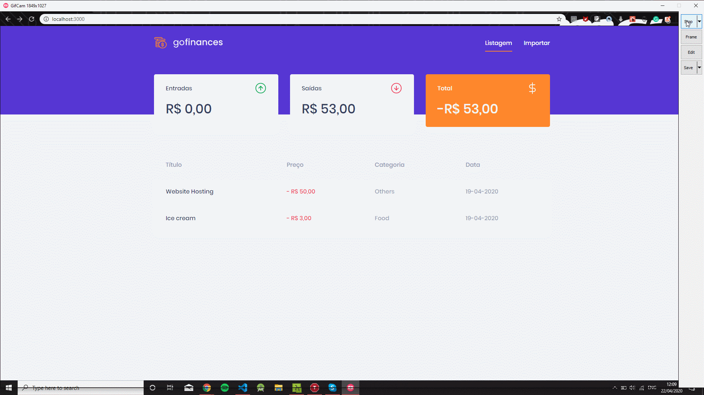

<h3 align="center">
Challenge 07: GoFinances Web
</h3>

"Don't expect brilliant results if your goals are not clear"!</blockquote>

  

  

  

  

  

  <a href="#rocket-sobre-o-desafio">About the challenge</a>&nbsp;&nbsp;&nbsp;|&nbsp;&nbsp;&nbsp;
  <a href="#memo-licença">License</a>

## :rocket: About the challenge

In this challenge, you must continue to develop the transaction management application, GoFinances. Now you will practice what you have learned so far in React.js along with TypeScript, using routes and sending files by form.

This will be an application that will connect to your [Challenge 06] backend (https://github.com/Rocketseat/bootcamp-gostack-desafios/tree/master/desafio-database-upload), and display the transactions created and allow importing a CSV file to generate new records in the database.

Now navigate to the created folder and open it in Visual Studio Code, remember to run the `yarn` command on your terminal to install all dependencies.

### Application layout

This application has a layout that you can follow to be able to visualize its operation.

The layout can be accessed through the Figma page, at the [following link] (https://www.figma.com/file/EgOhyj1Inz14dhWGVhRlhr/GoFinances?node-id=1%3A863).

You will need a (free) account at Figma to inspect the layout and get details of colors, sizes, etc.

### Application features

Now that you have the template cloned and ready to continue, you should check the files in the `src` folder and complete where there is no code, with the code to achieve the objectives of each route.

- **`List your API repositories`**: Your` Dashboard` page should be able to display a listing through a table, with the `title`,` value`, `type` and` category` field of all transactions that are registered in your API.

- **`Display your API balance`**: On your` Dashboard` page, you must display the balance that is returned from your backend, containing the grand total, together with the total of inputs and outputs.

- **`Import CSV`files **: On your` Import` page, you must allow sending a file in `csv` format to your backend, which will import the transactions into your database. The csv file must follow the following [template] (https://github.com/Rocketseat/bootcamp-gostack-desafios/blob/master/desafio-database-upload/assets/file.csv).

### Testing specification

In each test, you have a brief description of what your application must do in order for the test to pass.

If you have questions about what the tests are, and how to interpret them, take a look at ** [our FAQ] (https://github.com/Rocketseat/bootcamp-gostack-desafios/tree/master/faq- challenges). **

For this challenge, we have the following tests:

- **`should be able to list the total balance inside the cards`**: In order for this test to pass, your application must allow cards containing the total 'income`,` outcome` and the total subtraction of income - outcome that are returned by the balance of your backend.

* **`should be able to list the transactions`**: For this test to pass, your application must allow all transactions that are returned from your backend to be listed within a table.

- **`should be able to navigate to the import page`**: For this test to pass, you must allow the page change through the Header, by the button that contains the name` Import`.

- **`should be able to upload a file`**: In order for this test to pass, you must allow a file to be uploaded via the drag-n-drop component on the` import` page, and you can view it the name of the file sent to the input.

## :memo: License

This project is under the MIT license. See the [LICENSE] file for more details.
